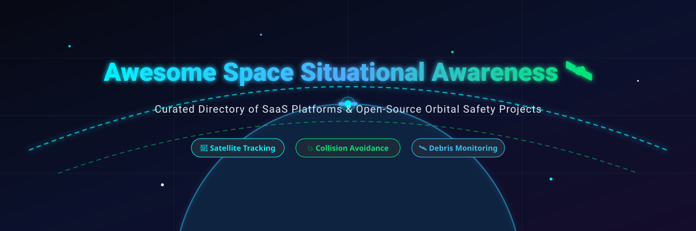

# Awesome Space Situational Awareness (SSA) 🛰️ ✨

  
  
  
  
  
  

  

---

## 📌 Top Space Situational Awareness (SSA) & Space Domain Awareness (SDA) Ecosystem

> **A curated, SEO-optimized directory of commercial SaaS platforms & open-source GitHub projects focused on Satellite Tracking, Conjunction Assessment (CA), Orbital Debris Monitoring, Collision Avoidance, Space Traffic Management (STM), and SGP4/TLE Astrodynamics.** 🚀

**Last updated: September 2026** 📅

---

### 📖 Table of Contents
- [🔍 Overview](#-overview)
- [🏢 SaaS & Hosted Platforms](#-saas--hosted-platforms)
- [💻 Open-Source GitHub Projects](#-open-source-github-projects)
- [🛠️ Astrodynamics & Tooling Frameworks](#%EF%B8%8F-astrodynamics--tooling-frameworks)
- [🤝 How to Contribute](#-how-to-contribute)
- [⚠️ Disclaimer](#%EF%B8%8F-disclaimer)
- [📈 Star History](#-star-history)

---

## 🔍 Overview

Space Situational Awareness (SSA) and Space Domain Awareness (SDA) are critical disciplines for maintaining safe, sustainable operations in Low Earth Orbit (LEO), Medium Earth Orbit (MEO), and Geostationary Orbit (GEO). 

With tens of thousands of active satellites and tracking catalog objects currently monitored, satellite operators, defense agencies, and commercial space entities rely on specialized SSA systems to:
- 📡 **Track Satellite Trajectories & TLE Orbits** using radar and optical ground/space telescope networks.
- 💥 **Evaluate Conjunction Risk & CDM Messages** (Conjunction Data Messages) to calculate Probability of Collision ($P_c$).
- 🛡️ **Plan Collision Avoidance Maneuvers** to prevent Kessler syndrome cascade events.
- 🌐 **Coordinate Space Traffic (STM)** to maintain orbital sustainability.

---

## 🏢 SaaS & Hosted Platforms

> 🌐 **Market Overview & Industry Structure**:  
> The global Space Situational Awareness (SSA) & Space Traffic Management (STM) market is estimated at **$1.8B – $2.5B in 2026** and is projected to surpass **$3.5B+ by 2030** (CAGR ~8–10%). The sector currently exhibits a **moderately fragmented market structure** featuring specialized radar/optical sensor operators and AI analytics software vendors. However, significant capital expenditure for ground infrastructure and strong network effects around tracking catalog data are driving consolidation toward a **concentrated, multi-polar market** led by top category pioneers.

The table below lists leading commercial SaaS SSA and SDA platforms, **sorted by Company Size (Valuation / Revenue descending)**:

| 🚀 Platform | 📝 Description | 💰 Starting Price | 🎁 Free Tier / Trial Limit | 📊 Company Size (Valuation / Revenue) |
| :--- | :--- | :--- | :--- | :--- |
| **[LeoLabs](https://leolabs.space/)** | Commercial SSA leader operating a global radar network for LEO mapping, object tracking, and automated space traffic management services. | $2,500 / month per satellite (LeoTrack standard tracking tier) | Free LEO Visualizer platform (interactive 3D map for viewing ~20,000+ LEO catalog objects; 0 API calls or automated alerts) | **~$430M Valuation** / ~$50M+ Revenue 📈 |
| **[ExoAnalytic Solutions](https://exoanalytic.com/)** | Optical SSA and space domain awareness provider specializing in GEO & deep-space regimes with a global telescope network. (Acquired by Anduril). | $1,000 / month per satellite (ExoTrack Orbits Service tier) | 14-day free trial (access to optical telescope tracking data and orbital updates for up to 2 verified satellites) | **~$250M Valuation** / ~$30M Revenue 🏢 |
| **[Slingshot Aerospace](https://www.slingshotaerospace.com/)** | AI-powered platform fusing satellite data for orbital risk detection, anomaly monitoring, and space domain awareness (Slingshot Beacon). | $1,200 / month per satellite (Slingshot Beacon Premium tier) | Free-forever basic tier (provides essential collision avoidance screening, CDM parsing, and inter-operator chat for unlimited fleet satellites) | **~$190M Valuation** / ~$30M Revenue 📊 |
| **[Look Up Space](https://www.lookupspace.com/)** | European SSA provider utilizing its SORASYS radar network and SYNAPSE digital platform for real-time orbital collision assessment. | €2,000 / month (~$2,160/mo) per satellite (SYNAPSE real-time collision risk & analytics suite) | 14-day free trial (access to SYNAPSE dashboard, real-time catalog screening, and conjunction alerts for 1 verified satellite asset) | **~$150M Valuation** / ~$12M Revenue 💶 |
| **[Privateer Space](https://www.privateer.space/)** | Space environmental intelligence platform offering orbital debris tracking, 3D Wayfinder visualizer, and AWS Wayfinder API services. | $100 / month base fee + $0.001 per API request (AWS Marketplace Wayfinder API) | Free-forever web app (Wayfinder interactive 3D orbital debris visualizer; 0 external API calls included) | **~$110M Valuation** / ~$8M Revenue 🚀 |
| **[COMSPOC](https://comspoc.com/)** | Commercial space operations center delivering high-fidelity orbit determination, conjunction risk assessment, and SSASuite analytics. | $500 / month (ARGUS ephemeris & SSASuite entry tier) | Free-forever Spacebook account (3D orbital visualizer & ephemeris data viewer; restricted to 5 saved views & manual query rate limits) | **~$70M Valuation** / ~$20M Revenue 🏛️ |
| **[Kayhan Space](https://kayhan.space/)** | Autonomous collision avoidance and space traffic coordination platform (Satcat & Pathfinder) for automated satellite maneuver planning. | $1,900 / month (Pro tier for up to 3 satellites) | Free-forever plan (Kayhan/Pathfinder Essentials: baseline satellite tracking, automated CDM parsing, and conjunction alerts for unlimited satellites) | **~$60M Valuation** / ~$8M Revenue 🛰️ |
| **[Share My Space (Aldoria)](https://www.sharemyspace.com/)** | European SSA provider deploying optical sensor networks and real-time orbital intelligence for space debris tracking and conjunction alerts. | €1,500 / month (~$1,620/mo) per satellite (LEO conjunction assessment & maneuver alert service) | Free academic & sustainability plan (free observation datasets for non-commercial researchers, university students, and debris removal missions upon request) | **~$40M Valuation** / ~$5M Revenue 🌍 |
| **[Scout Space](https://scout.space/)** | In-space observation and Space Domain Awareness (SDA) provider utilizing spacecraft optical sensors and the Overwatch analytics suite. | $2,000 / month per satellite (Overwatch SDA telemetry data feed tier) | 30-day free trial (access to simulated in-space optical tracking telemetry, sample CDM alerts, and 3D proximity visualization for 1 test asset) | **~$35M Valuation** / ~$4M Revenue 🛰️ |
| **[Okapi:Orbits](https://okapiorbits.space/)** | AI-based space traffic management platform (OKAPI:Aether & OKAPI:Astrolabe) offering automated collision risk prediction and maneuver optimization. | €850 / month (~$920/mo) per satellite (OKAPI:Aether collision avoidance & risk prediction subscription) | 30-day free trial (access to OKAPI:Aether platform, automated CDM processing, and maneuver calculation tools for up to 2 test satellites) | **~$250M Valuation** / ~$3M Revenue 💶 |

---

## 💻 Open-Source GitHub Projects

Open-source SSA tools empower researchers, satellite operators, and developers to perform conjunction screening, propagate satellite trajectories (SGP4/SDP4), calculate collision probabilities ($P_c$), and visualize orbital paths using public CelesTrak and Space-Track data.

The list below is **sorted by GitHub Star Count (descending)**, with star badges linking directly to each repository's stargazers page:

1. **[Skyfield](https://github.com/skyfielders/python-skyfield)**   
   ⭐ **1,765+ stars** | High-precision astronomy and orbital mechanics library for Python. Computes satellite positions using SGP4, planetary orbits, and Earth orientation parameters.

2. **[poliastro](https://github.com/poliastro/poliastro)**   
   ⭐ **1,013+ stars** | Open-source Python library for interactive astrodynamics and orbital mechanics. Supports Keplerian orbit propagation, Lambert problem solvers, and maneuver analysis.

3. **[python-sgp4](https://github.com/brandon-rhodes/python-sgp4)**   
   ⭐ **470+ stars** | Python implementation of the SGP4 satellite propagation algorithm (USAF / Space-Track standard) for computing satellite positions and velocities from Two-Line Element (TLE) sets.

4. **[NASA CARA Analysis Tools](https://github.com/nasa/CARA_Analysis_Tools)**   
   ⭐ **110+ stars** | Public algorithms and software kits from NASA’s Conjunction Assessment Risk Analysis (CARA) team for calculating 2D/3D collision probability ($P_c$) and evaluating satellite conjunction risk.

5. **[TudatPy](https://github.com/tudat-team/tudatpy)**   
   ⭐ **88+ stars** | Python interface for TU Delft's C++ Tudat astrodynamics library, providing numerical orbit propagation, perturbation modeling, and trajectory estimation.

6. **[ESA Cascade](https://github.com/esa/cascade)**   
   ⭐ **40+ stars** | C++/Python framework from the European Space Agency (ESA) for propagating large satellite populations and debris constellations while detecting conjunctions and collisions.

7. **[SatGuard](https://github.com/cesabici-bit/satguard)**   
   ⭐ **4+ stars** | End-to-end open-source conjunction assessment pipeline covering TLE ingestion, SGP4 propagation, Foster/Chan collision probability estimation, 3D CesiumJS visualization, and maneuver planning concepts.

8. **[COCA](https://github.com/ASTRONIAN/COCA)**   
   ⭐ **2+ stars** | Conjunction assessment and collision-avoidance maneuver planning toolkit using public TLE element sets and covariance estimation.

9. **[OrbVeil](https://github.com/ncdrone/orbveil)**   
   ⭐ **1+ star** | High-performance satellite conjunction screening engine designed to screen ~30,000 catalog objects in seconds, parse Conjunction Data Messages (CDMs), and compute collision risk.

10. **[Kessler](https://github.com/siddhashutosh/kessler)**   
    ⭐ **1+ star** | Open orbital conjunction risk assessment toolkit that parses Space-Track CDMs, computes collision probability via Foster & Chan methods, and ranks operational risks.

11. **[nano-debris](https://github.com/jahitjanberk/nano-debris)**   
    ⭐ **1+ star** | Lightweight, single-file real-time space debris monitoring dashboard that ingests CelesTrak TLE data, propagates positions via SGP4, and renders 3D interactive orbital maps.

---

## 🛠️ Astrodynamics & Tooling Frameworks

- **SGP4 / SDP4 Libraries**: Core orbital propagation algorithms in Python, C++, Java, and JavaScript.
- **Orekit / poliastro**: Industry-grade astrodynamics libraries supporting orbit determination and perturbation modeling.
- **CelesTrak & Space-Track Tooling**: Automated scripts for ingesting public Two-Line Element (TLE) sets and CDM notifications.
- **3D Orbital Visualization**: CesiumJS and WebGL viewers for rendering satellite constellations and close approach geometry.

---

## 🤝 How to Contribute

Contributions are highly welcome! To add or update an SSA product or open-source tool:
1. 🍴 **Fork** this repository.
2. 📝 Add your entry to `README.md` following the established table / list structure.
3. 💬 Ensure all pricing, limits, star links, and factual descriptions are accurate.
4. 🚀 Submit a **Pull Request (PR)** with a clear summary.

Check out [Awesome-Awesome-Awesome](https://github.com/ishandutta2007/Awesome-Awesome-Awesome) for more curated lists! 🌟

---

## ⚠️ Disclaimer

- This list is **community-curated** for informational and educational purposes only.
- Space situational awareness and collision avoidance are safety-critical. Operational maneuver decisions should rely on validated, regulatory-grade catalog data and official Space-Track/operator CDMs.

---

## 📈 Star History

---

  <b>Made for satellite operators, SSA analysts, space traffic managers, researchers, and space sustainability advocates. 🛰️🌍</b>

